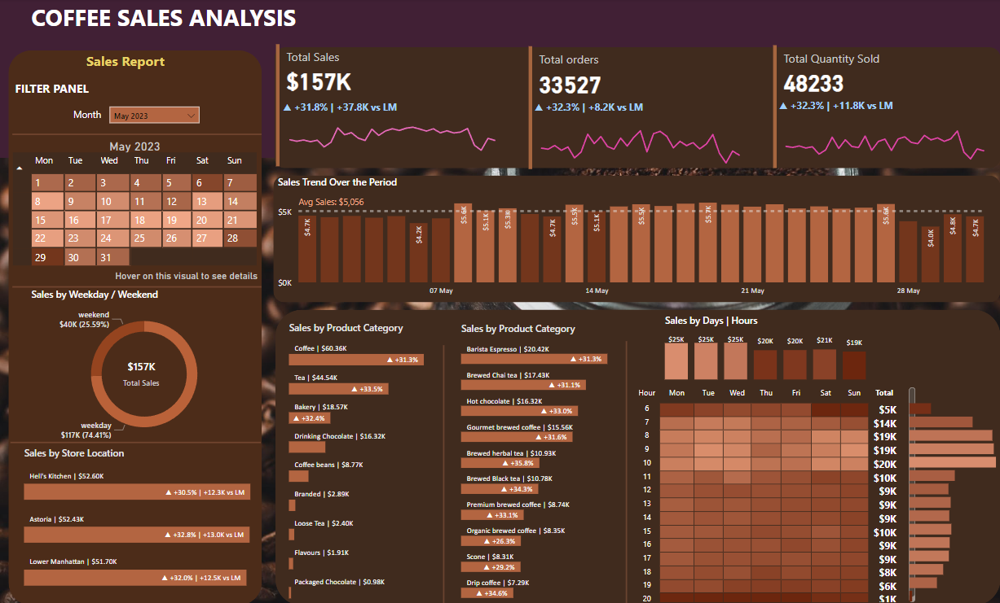

# Coffee Shop Sales Analysis Dashboard


## Overview
This project aims to analyze and visualize sales performance, order patterns, and product category insights for a coffee shop chain. The Power BI dashboard provides an in-depth look at key metrics such as total sales, orders, and quantity sold. Users can explore month-over-month trends, daily performance, and even hourly sales through dynamic charts and heat maps.




### Key Analysis & Features

1. **Total Sales Analysis**
   - Calculate total sales for each month.
   - Analyze month-over-month (MoM) sales trends.
   - Calculate the difference in sales between the selected month and the previous month.

2. **Total Orders Analysis**
   - Calculate total number of orders for each month.
   - Determine MoM changes in the number of orders.
   - Show the difference in the number of orders between the selected month and the previous month.

3. **Total Quantity Sold Analysis**
   - Calculate total quantity sold each month.
   - Analyze MoM changes in the total quantity sold.
   - Calculate the difference in total quantity sold between the selected month and the previous month.

### Visualization & Charts

1. **Calendar Heat Map**
   - A dynamic calendar heat map that adjusts based on the selected month from a slicer.
   - Each day is color-coded based on sales volume, with darker shades representing higher sales.
   - Tooltips provide additional insights (Sales, Orders, Quantity) when hovering over a specific day.

2. **Sales Analysis by Weekdays and Weekends**
   - Segment sales data to compare weekdays versus weekends.
   - Visual insights into sales performance differences between the two timeframes.

3. **Sales Analysis by Store Location**
   - Visualize sales data by store location.
   - Show month-over-month differences for each store based on the selected month.
   - Highlight increases or decreases in sales at each location.

4. **Daily Sales Analysis with Average Line**
   - A line chart displaying daily sales for the selected month.
   - Incorporates an average line to show the average daily sales.
   - Highlights days where sales exceeded or fell below the average.

5. **Sales Analysis by Product Category**
   - Analyze sales performance across different product categories.
   - Insights into which product categories contribute most to total sales.

6. **Top 10 Products by Sales**
   - Identify and display the top 10 products based on sales volume.
   - Quick visualization of best-performing products.

7. **Sales Analysis by Days and Hours**
   - A heat map visualizing sales patterns by days of the week and hours of the day.
   - Tooltips provide additional details (Sales, Orders, Quantity) when hovering over a specific day-hour combination.
  
  ## Usage 🛠️

1. **Download or clone the repository**:
   ```bash
   git clone https://github.com/shreya-shetty-ujire/dataAnalysis-powerBi.git
